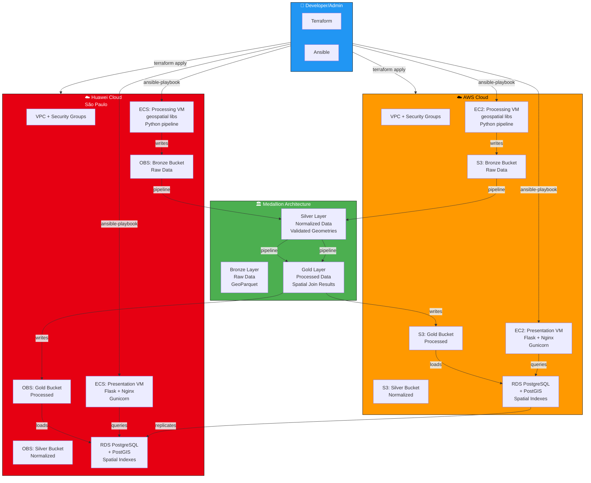

# Mermaid Diagrams - Esteira Geo

Diagramas de arquitetura em formato Mermaid para visualização e compreensão do projeto.

## 📊 Diagramas Disponíveis

### 1. Arquitetura Terraform/Ansible
**Arquivo**: `diagrams/terraform_architecture.mmd`

Deploy em **nuvem pública** com multi-cloud support (AWS + Huawei).



---

### 2. Arquitetura Docker Local
**Arquivo**: `diagrams/docker_architecture.mmd`

Ambiente **completo dockerizado** para desenvolvimento local.

```mermaid
graph TB
    subgraph host["🖥️ Host Machine<br/>Linux/macOS/Windows"]
        scripts["📜 Scripts<br/>docker.sh<br/>debug.sh<br/>setup.sh"]
        compose["🐳 Docker Compose"]
        make["⚙️ Makefile"]
    end
    
    subgraph docker_network["🌐 Docker Network: esteira-network"]
        
        subgraph postgis_service["PostgreSQL + PostGIS"]
            db["🗄️ PostgreSQL 13<br/>Database: esteira_geo<br/>User: esteira_user"]
            postgis_ext["PostGIS Extension<br/>Spatial Indexes<br/>GIST Indexes"]
            db_health["Health Check<br/>pg_isready"]
        end
        
        subgraph minio_service["MinIO (S3 Compatible)"]
            minio["📦 MinIO Server<br/>Port: 9000<br/>Creds: minioadmin"]
            minio_console["🖥️ MinIO Console<br/>Port: 9001<br/>UI para buckets"]
            minio_init["🔧 Bucket Init<br/>Creates:<br/>bronze, silver, gold"]
        end
        
        subgraph pipeline_service["Pipeline ETL"]
            pipeline_container["🐳 Pipeline Container<br/>Python 3.9<br/>GDAL, GeoPandas<br/>Rasterio, Fiona"]
            
            subgraph etl_flow["ETL Pipeline Flow"]
                bronze_loader["Bronze Loader<br/>Generate Sample Data<br/>3 flood areas<br/>+ 100 citizens"]
                silver_proc["Silver Processor<br/>Normalize & Validate<br/>Geometry checks<br/>Type standardization"]
                gold_proc["Gold Processor<br/>Spatial Join<br/>Identify affected<br/>citizens"]
                postgis_loader["PostGIS Loader<br/>Insert geometries<br/>Create indexes<br/>Statistics"]
            end
            
            bronze_loader -->|GeoParquet| silver_proc
            silver_proc -->|GeoParquet| gold_proc
            gold_proc -->|GeoParquet| postgis_loader
            postgis_loader -->|ST_GeomFromText| db
        end
        
        subgraph flask_service["Flask Web App"]
            flask["🌐 Flask Server<br/>Port: 5000<br/>Development Mode"]
            gunicorn["⚙️ Gunicorn<br/>4 Workers<br/>Production Ready"]
            nginx["🔀 Nginx<br/>Reverse Proxy<br/>Port: 80"]
            
            flask -->|WSGI| gunicorn
            gunicorn -->|HTTP| nginx
        end
        
        subgraph volumes["📁 Docker Volumes"]
            vol_postgres["postgres_data<br/>Database files"]
            vol_bronze["pipeline_bronze<br/>Raw GeoParquet"]
            vol_silver["pipeline_silver<br/>Normalized data"]
            vol_gold["pipeline_gold<br/>Processed data"]
            vol_minio["minio_data<br/>S3 storage"]
        end
    end
    
    host -->|docker-compose up| docker_network
    host -->|docker-compose exec| pipeline_service
    host -->|curl / browser| flask_service
    
    % Pipeline connections
    minio -->|upload bronze| vol_bronze
    vol_bronze -->|read| bronze_loader
    bronze_loader -->|write| vol_bronze
    vol_silver -->|store| silver_proc
    vol_gold -->|store| gold_proc
    vol_gold -->|read| flask_service
    
    % Database
    postgis_loader -->|persist| vol_postgres
    flask_service -->|query| db
    
    % MinIO
    pipeline_container -->|check health| minio
    flask_service -->|list buckets| minio_console
    
    % Health checks
    db -->|health| db_health
    minio -->|health| minio_init
    
    style host fill:#2196F3,stroke:#000,color:#fff
    style docker_network fill:#4CAF50,stroke:#000,color:#fff
    style postgis_service fill:#336791,stroke:#000,color:#fff
    style minio_service fill:#C41E3A,stroke:#000,color:#fff
    style pipeline_service fill:#F37021,stroke:#000,color:#fff
    style flask_service fill:#013243,stroke:#000,color:#fff
    style volumes fill:#9C27B0,stroke:#000,color:#fff
    style etl_flow fill:#FFC107,stroke:#000,color:#000
```

---

### 3. Fluxo Medallion (Bronze → Silver → Gold)
**Arquivo**: `diagrams/medallion_flow.mmd`

**Fluxo de dados** através das camadas de processamento.

```mermaid
graph LR
    subgraph input["📥 Input Data"]
        flooding["3 Flood Areas<br/>Polygons<br/>Porto Alegre"]
        citizens["100 Citizens<br/>Point Features<br/>Coordinates"]
    end
    
    subgraph bronze_layer["🟤 BRONZE Layer<br/>Raw Data Storage"]
        bronze_dir["S3/OBS/Local<br/>flooding_areas.parquet<br/>citizens.parquet"]
        bronze_meta["Metadata:<br/>EPSG:4326<br/>3,100 records<br/>Timestamp"]
    end
    
    subgraph silver_layer["⚪ SILVER Layer<br/>Normalized Data"]
        silver_dir["S3/OBS/Local<br/>flooding_areas.parquet<br/>citizens.parquet"]
        silver_checks["Quality Checks:<br/>✓ Remove duplicates<br/>✓ Validate geometries<br/>✓ Standardize types<br/>✓ Parse dates"]
        silver_meta["Schema:<br/>area_id: int64<br/>flood_date: datetime<br/>data_quality_score"]
    end
    
    subgraph gold_layer["🟡 GOLD Layer<br/>Processed & Analyzed"]
        spatial_join["🎯 Spatial Join<br/>ST_Contains<br/>citizen point within<br/>flood polygon"]
        affected["60 Affected<br/>Citizens<br/>Identified by<br/>flood area"]
        unaffected["40 Unaffected<br/>Citizens<br/>Safe zones"]
        summary["100 Total<br/>Citizens<br/>Summary info"]
    end
    
    subgraph postgis["🗺️ PostGIS<br/>Spatial Database"]
        tables["Tables:<br/>flooding_areas<br/>citizens<br/>GIST indexes<br/>GEOMETRY(POINT,4326)<br/>GEOMETRY(POLYGON,4326)"]
        queries["Queries:<br/>ST_Contains()<br/>ST_Distance()<br/>ST_Buffer()<br/>ST_Intersects()"]
        views["Views:<br/>v_citizens_summary<br/>Statistics<br/>Reports"]
    end
    
    subgraph visualization["🌐 Flask Dashboard"]
        dashboard["Web UI<br/>./index.html<br/>Real-time cards"]
        apis["REST APIs:<br/>/api/geometries<br/>/api/stats<br/>/health"]
        maps["Map Layers:<br/>Flood areas<br/>Citizens location<br/>Risk zones"]
    end
    
    input -->|load_sample_data| bronze_dir
    flooding -->|3 records| bronze_meta
    citizens -->|100 records| bronze_meta
    
    bronze_dir -->|read| silver_checks
    silver_checks -->|validate| silver_dir
    silver_meta -->|metadata| silver_dir
    
    silver_dir -->|read normalized| spatial_join
    spatial_join -->|✓ within| affected
    spatial_join -->|✗ outside| unaffected
    affected -->|write| gold_layer
    unaffected -->|write| gold_layer
    summary -->|aggregated| gold_layer
    
    gold_layer -->|ST_GeomFromText| postgis
    postgis -->|INSERT geometries| tables
    postgis -->|create GIST| tables
    tables -->|SELECT queries| queries
    queries -->|aggregate| views
    
    views -->|fetch data| apis
    apis -->|display| dashboard
    apis -->|render| maps
    
    style input fill:#FF6B6B,stroke:#000,color:#fff
    style bronze_layer fill:#8B6F47,stroke:#000,color:#fff
    style silver_layer fill:#D3D3D3,stroke:#000,color:#000
    style gold_layer fill:#FFD700,stroke:#000,color:#000
    style postgis fill:#336791,stroke:#000,color:#fff
    style visualization fill:#4CAF50,stroke:#000,color:#fff
```



---

## 🎨 Visualizar Online

Para visualizar e editar os diagramas online:

1. **Mermaid Live Editor**: https://mermaid.live
2. Copie o conteúdo dos arquivos `.mmd`
3. Cole no editor para visualizar

## 💾 Exporting Diagrams

Para salvar como PNG/SVG:

```bash
# Instalar ferramenta
npm install -g @mermaid-js/mermaid-cli

# Converter para PNG
mmdc -i diagrams/terraform_architecture.mmd -o diagrams/terraform_architecture.png
mmdc -i diagrams/docker_architecture.mmd -o diagrams/docker_architecture.png
mmdc -i diagrams/medallion_flow.mmd -o diagrams/medallion_flow.png
```

## 📚 Referência

- [DIAGRAMAS.md](./DIAGRAMAS.md) - Documentação dos diagramas
- [Mermaid Documentation](https://mermaid.js.org/)
- [Mermaid Live Editor](https://mermaid.live/)
