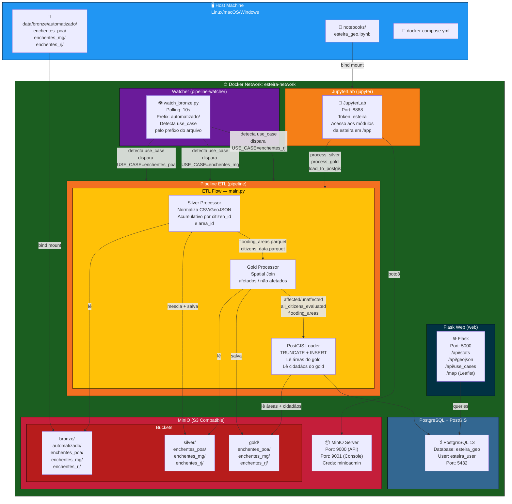

# Mermaid Diagrams - Esteira Geo

Diagramas de arquitetura em formato Mermaid refletindo o ambiente atual do projeto.

## 📊 Diagramas Disponíveis

---

### 1. Arquitetura Docker Local
**Arquivo**: `diagrams/docker_architecture.mmd`

Ambiente completo dockerizado para desenvolvimento local. Inclui watcher multi-use-case, JupyterLab e a estrutura `automatizado/` do bucket bronze.


```mermaid
graph TB
    subgraph host["🖥️ Host Machine\nLinux/macOS/Windows"]
        data_dir["📁 data/bronze/automatizado/\nenchentes_poa/\nenchentes_mg/\nenchentes_rj/"]
        notebooks_dir["📓 notebooks/\nesteira_geo.ipynb"]
        compose["🐳 docker-compose.yml"]
    end

    subgraph docker_network["🌐 Docker Network: esteira-network"]

        subgraph postgis_service["PostgreSQL + PostGIS"]
            db["🗄️ PostgreSQL 13\nDatabase: esteira_geo\nUser: esteira_user\nPort: 5432"]
        end

        subgraph minio_service["MinIO (S3 Compatible)"]
            minio["📦 MinIO Server\nPort: 9000 (API)\nPort: 9001 (Console)\nCreds: minioadmin"]
            subgraph buckets["Buckets"]
                b_bronze["bronze/\nautomatizado/\n  enchentes_poa/\n  enchentes_mg/\n  enchentes_rj/"]
                b_silver["silver/\nenchentes_poa/\nenchentes_mg/\nenchentes_rj/"]
                b_gold["gold/\nenchentes_poa/\nenchentes_mg/\nenchentes_rj/"]
            end
        end

        subgraph watcher_service["Watcher (pipeline-watcher)"]
            watcher["👁️ watch_bronze.py\nPolling: 10s\nPrefix: automatizado/\nDetecta use_case\npelo prefixo do arquivo"]
        end

        subgraph pipeline_service["Pipeline ETL (pipeline)"]
            subgraph etl_flow["ETL Flow — main.py"]
                silver_proc["Silver Processor\nNormaliza CSV/GeoJSON\nAcumulativo por citizen_id\ne area_id"]
                gold_proc["Gold Processor\nSpatial Join\nafetados / não afetados"]
                postgis_loader["PostGIS Loader\nTRUNCATE + INSERT\nLê áreas do gold\nLê cidadãos do gold"]
            end
            silver_proc -->|flooding_areas.parquet\ncitizens_data.parquet| gold_proc
            gold_proc -->|affected/unaffected\nall_citizens_evaluated\nflooding_areas| postgis_loader
            postgis_loader --> db
        end

        subgraph jupyter_service["JupyterLab (jupyter)"]
            jupyter["📓 JupyterLab\nPort: 8888\nToken: esteira\nAcesso aos módulos\nda esteira em /app"]
        end

        subgraph web_service["Flask Web (web)"]
            flask["🌐 Flask\nPort: 5000\n/api/stats\n/api/geojson\n/api/use_cases\n/map (Leaflet)"]
        end

    end

    data_dir -->|bind mount| b_bronze
    notebooks_dir -->|bind mount| jupyter_service

    watcher -->|detecta use_case\ndispara USE_CASE=enchentes_poa| pipeline_service
    watcher -->|detecta use_case\ndispara USE_CASE=enchentes_mg| pipeline_service
    watcher -->|detecta use_case\ndispara USE_CASE=enchentes_rj| pipeline_service

    silver_proc -->|lê| b_bronze
    silver_proc -->|mescla + salva| b_silver
    gold_proc -->|lê| b_silver
    gold_proc -->|salva| b_gold
    postgis_loader -->|lê áreas + cidadãos| b_gold

    jupyter -->|process_silver\nprocess_gold\nload_to_postgis| etl_flow
    jupyter -->|boto3| minio

    flask -->|queries| db

    style host fill:#2196F3,stroke:#000,color:#fff
    style docker_network fill:#1b5e20,stroke:#000,color:#fff
    style postgis_service fill:#336791,stroke:#000,color:#fff
    style minio_service fill:#C41E3A,stroke:#000,color:#fff
    style watcher_service fill:#6A1B9A,stroke:#000,color:#fff
    style pipeline_service fill:#F37021,stroke:#000,color:#fff
    style jupyter_service fill:#F57F17,stroke:#000,color:#fff
    style web_service fill:#013243,stroke:#000,color:#fff
    style etl_flow fill:#FFC107,stroke:#000,color:#000
    style buckets fill:#b71c1c,stroke:#000,color:#fff
```

---

### 2. Fluxo Medallion (Bronze → Silver → Gold → PostGIS)
**Arquivo**: `diagrams/medallion_flow.mmd`

Fluxo de dados completo com watcher multi-use-case, silver acumulativo e gold como única fonte de verdade do PostGIS.


```mermaid
graph LR
    subgraph input["📥 Ingestão\nbronze/automatizado/"]
        uc_poa["enchentes_poa/\nCSV + GeoJSON\n(cidadãos e áreas)"]
        uc_mg["enchentes_mg/\nCSV + GeoJSON\n(cidadãos e áreas)"]
        uc_rj["enchentes_rj/\nCSV + GeoJSON\n(cidadãos e áreas)"]
        processed["processados/\n(movido após leitura)"]
    end

    subgraph watcher["👁️ Watcher\nwatch_bronze.py"]
        poll["Polling S3\na cada 10s\nPrefix: automatizado/\nDetecta use_case\npelo caminho do arquivo"]
    end

    subgraph bronze_layer["🟤 BRONZE\nS3: bronze/automatizado/use_case/"]
        b_files["CSV / GeoJSON\nbrutos\n(sem transformação)"]
    end

    subgraph silver_layer["⚪ SILVER\nS3: silver/use_case/"]
        s_areas["silver_flooding_areas.parquet\nAcumulativo por area_id\n(keep last)"]
        s_citizens["silver_citizens_data.parquet\nAcumulativo por citizen_id\n(keep last)"]
        s_checks["Normalização:\n✓ Geometrias válidas\n✓ citizen_id → str\n✓ area_id → str\n✓ registration_date\n✓ Dedup por ID"]
    end

    subgraph gold_layer["🟡 GOLD\nS3: gold/use_case/"]
        g_join["🎯 Spatial Join\ngeopandas sjoin\nwithin / intersects"]
        g_affected["affected_citizens.parquet"]
        g_unaffected["unaffected_citizens.parquet"]
        g_all["all_citizens_evaluated.parquet"]
        g_areas["flooding_areas.parquet\n(fonte das áreas\npara o PostGIS)"]
    end

    subgraph postgis["🗺️ PostGIS\nesteira_geo"]
        pg_citizens["use_case_citizens\ngeometry POINT 4326\naffected_by_flooding\nGIST index"]
        pg_areas["use_case_flooding_areas\ngeometry POLYGON 4326\nGIST index"]
        pg_note["Fonte exclusiva: GOLD\nTRUNCATE + INSERT\na cada pipeline"]
    end

    subgraph flask["🌐 Flask\nPort 5000"]
        api_stats["/api/stats?use_case="]
        api_geojson["/api/geojson?use_case="]
        api_uc["/api/use_cases"]
        map_leaflet["/map\nLeaflet + MarkerCluster\ncircleMarker\nfitBounds automático"]
    end

    input --> watcher
    watcher -->|"USE_CASE=enchentes_poa\nmain.py"| bronze_layer
    watcher -->|"USE_CASE=enchentes_mg\nmain.py"| bronze_layer
    watcher -->|"USE_CASE=enchentes_rj\nmain.py"| bronze_layer

    bronze_layer --> s_checks
    s_checks --> s_areas
    s_checks --> s_citizens
    s_areas --> g_join
    s_citizens --> g_join
    g_join --> g_affected
    g_join --> g_unaffected
    g_join --> g_all
    s_areas -->|cópia para gold| g_areas

    g_affected --> pg_citizens
    g_unaffected --> pg_citizens
    g_areas --> pg_areas
    pg_note --- pg_citizens
    pg_note --- pg_areas

    pg_citizens --> api_stats
    pg_citizens --> api_geojson
    pg_areas --> api_geojson
    api_stats --> map_leaflet
    api_geojson --> map_leaflet
    api_uc --> map_leaflet

    uc_poa -->|arquivo processado| processed
    uc_mg -->|arquivo processado| processed
    uc_rj -->|arquivo processado| processed

    style input fill:#4E342E,stroke:#000,color:#fff
    style watcher fill:#6A1B9A,stroke:#000,color:#fff
    style bronze_layer fill:#5D4037,stroke:#000,color:#fff
    style silver_layer fill:#616161,stroke:#000,color:#fff
    style gold_layer fill:#F9A825,stroke:#000,color:#000
    style postgis fill:#336791,stroke:#000,color:#fff
    style flask fill:#013243,stroke:#000,color:#fff
```

---

### 3. Arquitetura Terraform/Ansible (Cloud)
**Arquivo**: `diagrams/terraform_architecture.mmd`

Deploy em nuvem pública com suporte multi-cloud (AWS + Huawei). O pipeline é agnóstico — mesma lógica, buckets diferentes.


```mermaid
graph TB
    subgraph user["👤 Developer/Admin"]
        tf["Terraform\n>= 1.0"]
        ansible["Ansible"]
    end

    subgraph aws["☁️ AWS Cloud"]
        aws_vpc["VPC + Security Groups"]
        aws_s3_b["S3: Bronze Bucket\nautomatizado/use_case/\nRaw CSV/GeoJSON"]
        aws_s3_s["S3: Silver Bucket\nuse_case/\nNormalizado + Acumulativo"]
        aws_s3_g["S3: Gold Bucket\nuse_case/\nSpatial Join Results\n+ flooding_areas"]
        aws_ec2_proc["EC2: Processing VM\nPython pipeline\nwatcher + main.py"]
        aws_ec2_web["EC2: Presentation VM\nFlask + Nginx\nLeaflet Dashboard"]
        aws_rds["RDS PostgreSQL\n+ PostGIS\nuse_case_citizens\nuse_case_flooding_areas"]
    end

    subgraph huawei["☁️ Huawei Cloud\nSão Paulo"]
        hw_vpc["VPC + Security Groups"]
        hw_obs_b["OBS: Bronze Bucket\nautomatizado/use_case/\nRaw CSV/GeoJSON"]
        hw_obs_s["OBS: Silver Bucket\nuse_case/\nNormalizado + Acumulativo"]
        hw_obs_g["OBS: Gold Bucket\nuse_case/\nSpatial Join Results\n+ flooding_areas"]
        hw_ecs_proc["ECS: Processing VM\nPython pipeline\nwatcher + main.py"]
        hw_ecs_web["ECS: Presentation VM\nFlask + Nginx\nLeaflet Dashboard"]
        hw_rds["RDS PostgreSQL\n+ PostGIS\nuse_case_citizens\nuse_case_flooding_areas"]
    end

    subgraph pipeline["🔄 Pipeline (por use_case)"]
        p_watcher["Watcher\nautomatizado/use_case/\n→ detecta use_case\n→ dispara main.py"]
        p_silver["Silver Processor\nNormaliza + Acumula\nCSV / GeoJSON → Parquet"]
        p_gold["Gold Processor\nSpatial Join\nafetados / não afetados"]
        p_postgis["PostGIS Loader\nTRUNCATE + INSERT\nFonte: gold bucket"]
        p_watcher --> p_silver --> p_gold --> p_postgis
    end

    user -->|terraform apply| aws
    user -->|terraform apply| huawei
    user -->|ansible-playbook processing.yml| aws_ec2_proc
    user -->|ansible-playbook presentation.yml| aws_ec2_web
    user -->|ansible-playbook processing.yml| hw_ecs_proc
    user -->|ansible-playbook presentation.yml| hw_ecs_web

    aws_ec2_proc -->|executa| pipeline
    pipeline -->|lê bronze| aws_s3_b
    pipeline -->|escreve silver| aws_s3_s
    pipeline -->|escreve gold| aws_s3_g
    pipeline -->|sincroniza| aws_rds

    hw_ecs_proc -->|executa| pipeline
    pipeline -->|lê bronze| hw_obs_b
    pipeline -->|escreve silver| hw_obs_s
    pipeline -->|escreve gold| hw_obs_g
    pipeline -->|sincroniza| hw_rds

    aws_ec2_web -->|queries| aws_rds
    hw_ecs_web -->|queries| hw_rds

    style aws fill:#FF9900,stroke:#000,color:#000
    style huawei fill:#E60012,stroke:#000,color:#fff
    style pipeline fill:#4CAF50,stroke:#000,color:#fff
    style user fill:#2196F3,stroke:#000,color:#fff
```

---

## 🎨 Visualizar Online

1. Abra [Mermaid Live Editor](https://mermaid.live)
2. Copie o conteúdo de um arquivo `.mmd` em `diagrams/`
3. Cole no editor

## 💾 Exportar para PNG/SVG

```bash
npm install -g @mermaid-js/mermaid-cli

mmdc -i diagrams/docker_architecture.mmd    -o diagrams/docker_architecture.png
mmdc -i diagrams/medallion_flow.mmd         -o diagrams/medallion_flow.png
mmdc -i diagrams/terraform_architecture.mmd -o diagrams/terraform_architecture.png
```
